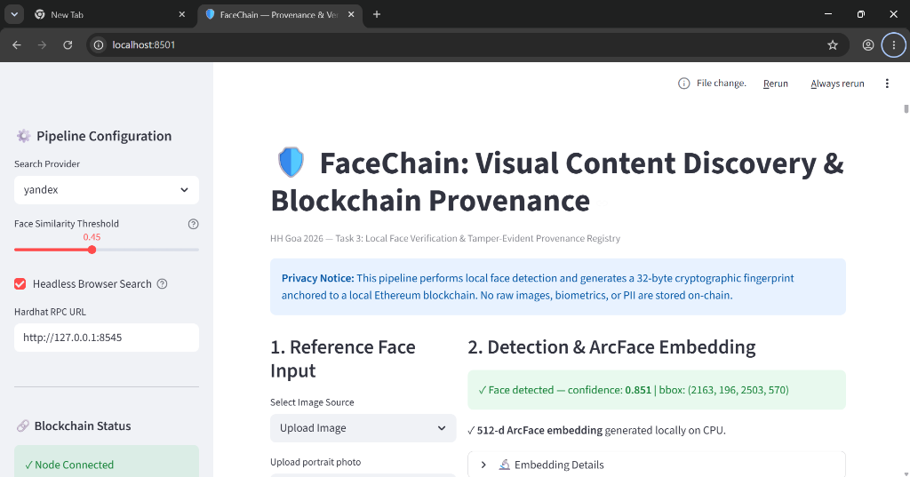
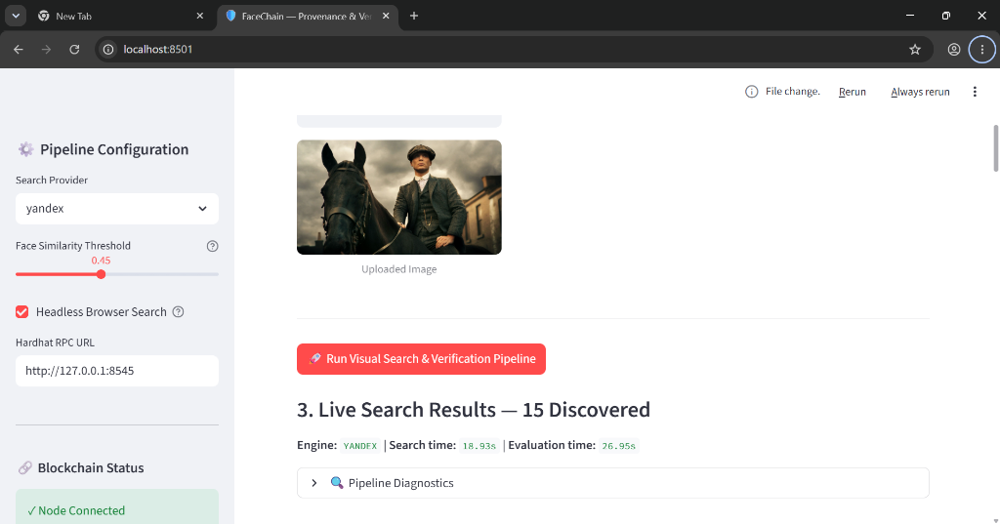
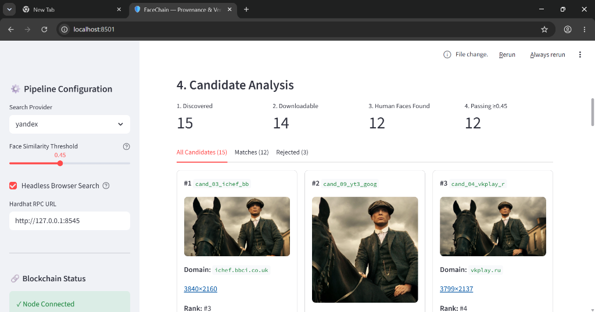
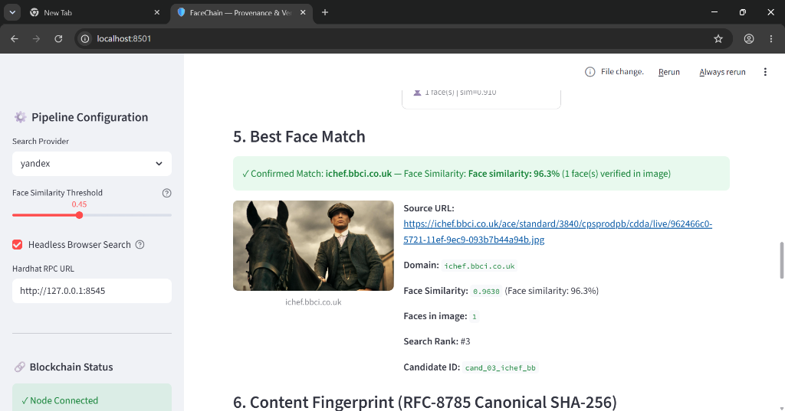
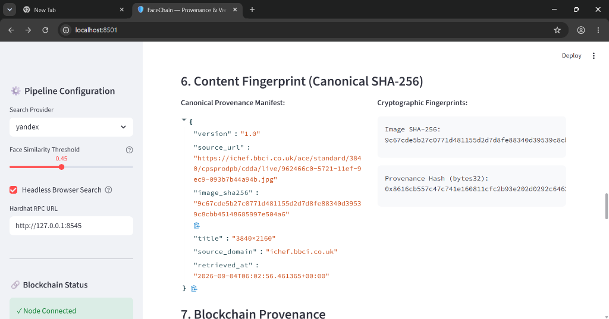
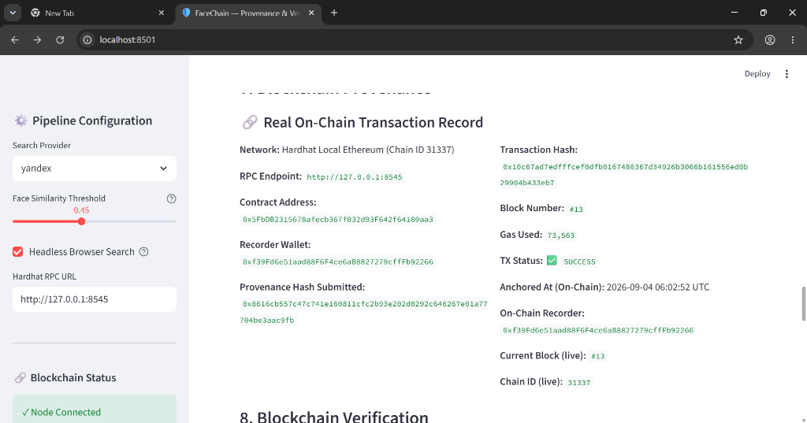
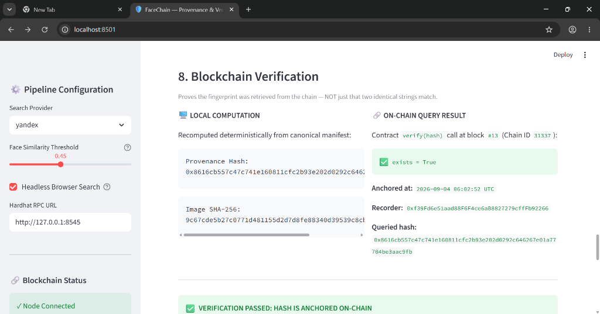

# FaceChain-Visual-Discovery-Blockchain-Verification-Engine

> **HH Goa 2026 — Task 3:** Local face verification, live visual web search, and tamper-evident blockchain provenance anchored on a local Ethereum network.

---

## 📸 Pipeline in Action

### Step 1 & 2 — Reference Face Input & ArcFace Embedding
*Live local face detection via InsightFace ArcFace — 512-dimensional vector embedding generated locally on CPU (confidence: 0.851)*



---

### Step 3 — Live Visual Web Search
*Real automated reverse-image search via Yandex Visual Search / Chromium engine — discovering live web instances in seconds*



---

### Step 4 — Candidate Analysis
*15 web images discovered, 14 downloaded, 12 human faces found, 12 passing threshold*



---

### Step 5 — Best Face Match
*ArcFace cosine similarity 96.3% — confirmed match from `ichef.bbci.co.uk`*



---

### Step 6 — Content Fingerprint
*Canonical SHA-256 manifest — deterministic, reproducible fingerprint of matched content*



---

### Step 7 — Blockchain Provenance (Real On-Chain TX)
*Transaction anchored on Hardhat local Ethereum — Block #13, Gas: 73,563, TX: SUCCESS*



---

### Step 8 — Blockchain Verification
*`contract.verify(hash)` RPC call returns `exists = True` — independently confirmed*



---

## 🧠 What This Does

| Step | Description |
|------|-------------|
| **1. Face Detection** | Detects and encodes a face from any input image using InsightFace ArcFace (512-d embeddings, CPU-only, fully local) |
| **2. Visual Search** | Performs a real reverse-image search via Yandex Visual Search / Bing / Google Lens using Playwright — **no hardcoded results** |
| **3. Face Matching** | Downloads each discovered candidate image and runs ArcFace cosine similarity against the reference face |
| **4. Blockchain Anchoring** | Computes a deterministic SHA-256 provenance fingerprint and anchors it to a local Hardhat Ethereum node |
| **5. Tamper Demonstration** | Modifies 3 pixels of the matched image and proves the tampered hash is **not** found on-chain |

---

## 🏗️ Architecture

```
task 3/
├── app.py                    # Streamlit UI (Sections 1-9)
├── main.py                   # CLI pipeline runner
├── config.py                 # All configuration (RPC, thresholds, paths)
│
├── pipeline/
│   ├── models.py             # CandidateResult dataclass (canonical schema)
│   └── executor.py           # Pipeline evaluation engine
│
├── face/
│   ├── detector.py           # InsightFace FaceAnalysis (ArcFace, CPU)
│   ├── embedding.py          # 512-d embedding extraction & matching
│   └── similarity.py         # Cosine similarity utilities
│
├── search/
│   ├── base.py               # SearchCandidate dataclass + abstract provider
│   ├── auto_visual.py        # Cascade: Lens → Bing → Yandex
│   ├── yandex_visual.py      # Yandex Visual Search via Playwright
│   └── ranking.py            # Multi-criteria candidate scoring
│
├── extraction/
│   ├── downloader.py         # Robust image download + validation
│   ├── metadata.py           # MatchedContentRecord builder
│   └── url_utils.py          # URL normalization utilities
│
├── fingerprint/
│   ├── canonical.py          # Deterministic manifest + SHA-256
│   └── hashing.py            # SHA-256 helpers
│
├── blockchain/
│   ├── client.py             # Web3 + ProvenanceRegistry contract client
│   └── verifier.py           # verify_content() + tamper demonstration
│
├── contracts/
│   └── ProvenanceRegistry.sol # Solidity contract: record() + verify()
│
├── hardhat/
│   ├── hardhat.config.js
│   └── scripts/deploy.js     # Deploys contract, writes contract_abi.json
│
└── tests/                    # 36 pytest unit tests
```

---

## ⚡ Quick Start

### Prerequisites

- Python 3.10+
- Node.js 18+ (for Hardhat)
- `pip install -r requirements.txt`
- `playwright install chromium`

### 1. Start Hardhat Local Blockchain

```bash
cd hardhat
npm install
npx hardhat node
```

### 2. Deploy Smart Contract

```bash
# In a second terminal:
cd hardhat
npx hardhat run scripts/deploy.js --network localhost
```

This writes the contract address + ABI to `blockchain/contract_abi.json`.

### 3. Run Streamlit UI

```bash
# In a third terminal (from project root):
streamlit run app.py
```

Open **http://localhost:8501**

---

## 🖥️ Using the UI

1. **Select Reference Image** — upload a portrait photo or pick a demo image
2. **Face is detected** automatically — confidence score + 512-d embedding shown
3. Click **🚀 Run Visual Search & Verification Pipeline**
4. The pipeline:
   - Queries Yandex/Bing with your image (live reverse image search)
   - Downloads each result and runs face detection
   - Ranks by ArcFace cosine similarity
5. **Section 7** — anchor the best match to Hardhat blockchain
6. **Section 8** — verify via `contract.verify(hash)` RPC call
7. **Section 9** — click tamper button → blockchain rejects the modified hash

---

## 🔬 Testing With a Friend's Photo

1. Upload their portrait via the **"Upload Image"** option in Section 1
2. The pipeline searches the web for visually similar faces
3. Any social media images found are compared against the reference embedding
4. Only candidates scoring above the **Face Similarity Threshold** (default 0.45) are classified as MATCH
5. The top match is fingerprinted and anchored to blockchain

---

## 🔗 Blockchain Details

| Property | Value |
|----------|-------|
| Network | Hardhat Local Ethereum |
| Chain ID | 31337 |
| RPC | `http://127.0.0.1:8545` |
| Contract | `ProvenanceRegistry.sol` |
| Record function | `record(bytes32 hash)` |
| Verify function | `verify(bytes32 hash) → (exists, timestamp, recorder)` |

**On-chain data stored:** Only a 32-byte SHA-256 hash. No raw images, biometrics, or PII.

---

## 🧪 Running Tests

```bash
pytest tests -v
# 36 passed
```

Tests cover:
- `CandidateResult` schema invariants (is_match always present in every state)
- Blockchain record/verify round-trip
- Image download validation (rejects HTML, corrupted data)
- SHA-256 canonicalization
- Tamper detection (1 pixel change = completely different hash)
- Cosine similarity edge cases

---

## 🛡️ Tamper Demonstration

When you click **"Simulate Content Tampering"**:

1. 3 corner pixels are inverted in the matched image
2. SHA-256 is recomputed on the modified bytes
3. `contract.verify(tampered_hash)` returns `exists = False`
4. Original hash still returns `exists = True`

This proves the cryptographic binding between image content and blockchain record.

---

## 🔒 Privacy

- All face detection runs **locally on CPU** (InsightFace, no cloud API)
- Only a 32-byte hash is sent to the local blockchain node
- No biometric data leaves your machine
- Searched images are downloaded temporarily to `data/cache/` only

---

## 📦 Key Dependencies

| Package | Purpose |
|---------|---------|
| `insightface` | ArcFace face detection + embedding |
| `streamlit` | Web UI |
| `playwright` | Browser automation for visual search |
| `web3` | Ethereum contract interaction |
| `Pillow` | Image loading + validation |
| `opencv-python` | Image decoding (primary) |
| `pytest` | Test runner |
